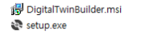
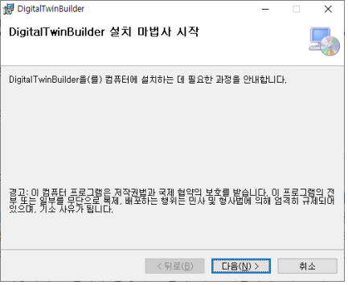
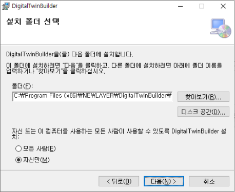
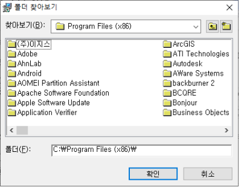
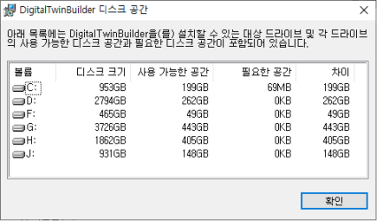
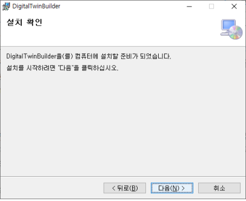
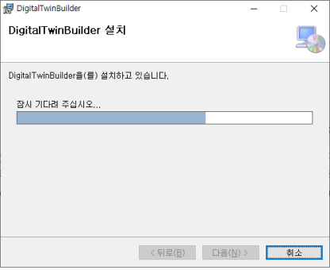
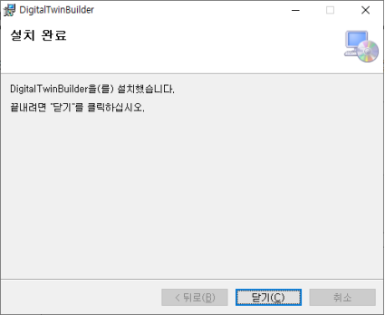

# 설치하기

제공된 설치 파일을 보면 다음과 같이 구성되며

<figure><figcaption>
&#x3C; 설치 파일 >
</figcaption></figure>

Setup.exe 파일를 실행하면 다음과 같이 설치화면이 실행된다.

<figure><figcaption>
&#x3C; 설치 시작 화면 >
</figcaption></figure>

“다음(N)“ 버튼을 마우스 클릭하면 설치 위치를 물어보는 화면으로 이동한다.

<figure><figcaption>
&#x3C; 설치 설정 >
</figcaption></figure>

설치폴더 선택 화면으로 "폴더(F)" 아래의 설치할 위치를 확인한다. 만약에 설치할 위치를 변경하고자 하는 경우는 "찾아보기(R)" 버튼을 마우스로 클릭하게 되면 다음과 같이 설치를 원하는 폴더를 선택하고 “확인” 버튼을 선택해서 돌아온다.

<figure><figcaption>
&#x3C; 설치 폴더 설정 >
</figcaption></figure>

디스크 공간(D)를 선택하게 되면 설치하고자 하는 폴더가 있는 드라이브에 프로그램에 설치가 필요한 공간과 여유공간을 다음과 같이 확인이 가능하고 필요한 설치공간이 부족할 경우는 반드시 다른 드라이브를 선택해서 설치를 진행해야한다.

<figure><figcaption>
&#x3C; 여유 공간 확인 >
</figcaption></figure>

설치 폴더에 대한 결정이 끝났으면 "모든사람(E)", "자신만(M)" 할 것인지 선택을 한다. "모든사람(E)“을 선택하는 경우는 Digital Twin Builder를 컴퓨터의 모든 사람이 사용가능하게 설치를 하는 것이고 "자신만(M)"을 선택하는 경우는 본 프로그램을 설치하기 위해서 로그인 사용자만 사용가능하게 하는 것이다. 사용자에 대한 선택을 하고 난 다음에는 ”다음(N)"을 선택하여 새로운 설치화면으로 넘어가게된다.

<figure><figcaption>
&#x3C; 설치 설정 종료 >
</figcaption></figure>

설치확인 화면으로 Digital Twin Builder를 설치할 준비가 완료되었다는 메세지 화면이고 만약에 설치할 위치는 정보를 변경하기 위해서는 “뒤로(B)" 버튼을 선택해서 변경하고자 하는 화면까지 이동한 후에 설치 정보를 변경해서 본 화면으로 돌아오면 된다. ”다음(N)" 버튼을 실행하게 되면 Digital Twin Builder 프로그램 설치 진행화면이 뜨면서 설치를 진행한다.

<figure><figcaption>
&#x3C; 설치 진행률 >
</figcaption></figure>

설치가 진행되는 진행 정도를 확인할 수 있으며 설치 진행이 완료가 되면 다음과 같이 설치가 완료되었다는 메세지 창이 뜨며 “닫기(C)" 버튼을 실행해서 설치를 종료한다.

<figure><figcaption>
&#x3C; 설치 종료 >
</figcaption></figure>
